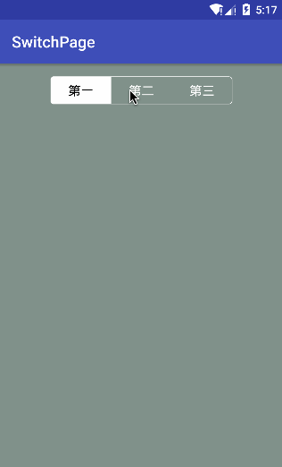

# SwitchPage
 
   
这是一个常见的切页工具，使用方法可以直接copy项目中的library或者引入：
### gradle:
```groovy
dependencies {
    ...
    compile 'sing.switchpage:library:1.0.1'
}
```
其中包含了如下的自定义属性：  
 
属性  | 描述  
------------- | -------------  
titles | 标题（“,”分割，方便在xml直接写入）
fill\_color | 填充颜色
press\_color | 按下后的填充颜色
radius | 四角弧度
stroke\_width | 边框宽度
stroke\_color | 边框颜色
text\_color | 文字颜色
text\_select\_color | 选择后的文字颜色
text\_size | 文字大小

## 使用方法
###### 1、XML编写
```XML
 <sing.widget.SwitchPage
    android:id="@+id/page"
    android:layout_width="230dp"
    android:layout_height="35dp"
    app:fill_color="@android:color/transparent"
    app:press_color="@android:color/white"
    app:radius="4dp"
    app:stroke_color="@android:color/white"
    app:stroke_width="0.5dp"
    app:text_color="@android:color/white"
    app:text_select_color="@android:color/black"
    app:text_size="16sp"
    app:titles="第一,第二,第三" />
```
```JAVA
@Override
protected void onCreate(Bundle savedInstanceState) {
    super.onCreate(savedInstanceState);
    setContentView(R.layout.activity_main);

    SwitchPage page = (SwitchPage) findViewById(R.id.page);
    // 点击的返回监听
    page.setOnClickListener(new SwitchPage.OnClickListener() {
        @Override
        public void selected(int position, String txt) {
            Toast.makeText(MainActivity.this,"选择了第"+(position+1)+"个，标题是："+txt,Toast.LENGTH_SHORT).show();
        }
    });
}
```
###### 2、代码编写
```XML
<?xml version="1.0" encoding="utf-8"?>
<LinearLayout xmlns:android="http://schemas.android.com/apk/res/android" 
    android:id="@+id/parent"
    android:layout_width="match_parent"
    android:layout_height="match_parent"
    android:background="#7e123123"
    android:gravity="center_horizontal"
    android:orientation="vertical"
    android:padding="16dp">
    <!-- 没有内容，只有id -->
</LinearLayout>
```
```JAVA
@Override
protected void onCreate(Bundle savedInstanceState) {
    super.onCreate(savedInstanceState);
    setContentView(R.layout.activity_main);

    SwitchPage page = new SwitchPage.Builder(this)
	                .setTitles("第一,第二,第三")
	                .setFillColor("#00000000")
	                .setPressColor("#FFFFFF")
	                .setRadius(8)
	                .setStrokeWidth(1)
	                .setStrokeColor("#FFFFFF")
	                .setTextColor("#FFFFFF")
	                .setTextSelectColor("#000000")
	                .setTextSize(32)//转换后的大小 px
	                .build();
    page.setLayoutParams(new LinearLayout.LayoutParams(560,80));// 控件大小自己定义
    ((LinearLayout)findViewById(R.id.parent)).addView(page,0);//添加到跟布局的指定位置
    
    page.setOnClickListener(new SwitchPage.OnClickListener() {
            
        @Override
        public void selected(int position, String txt) {
            Toast.makeText(MainActivity.this,"选择了第"+(position+1)+"个，标题是："+txt,Toast.LENGTH_SHORT).show();
        }
    });
}
```
